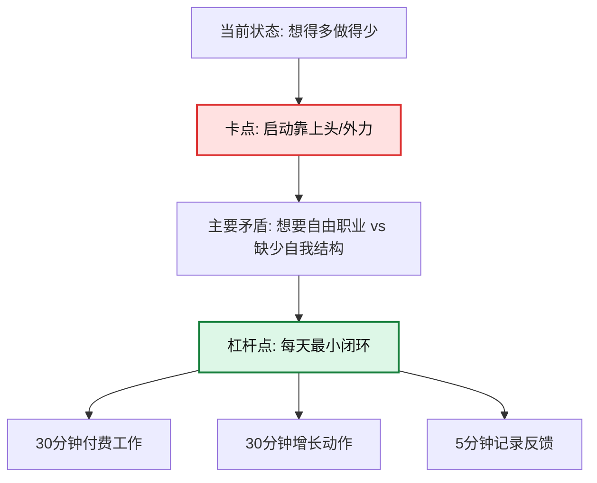

# Life Review

## Purpose

Use this skill to turn a concrete life event into a diagnosis, a visual map, and a small execution system. The goal is not comfort-only reflection; produce clear current difficulties, core stuck points, primary and secondary contradictions, root causes, philosophical interpretation, direct advice, Mermaid flowcharts, a 7-day experiment, and a way to review whether the experiment worked.

For full scoring criteria, domain modules, method library, source map, and extended templates, load `references/lrs-100.md`.

For opt-in personal memory, long-term user context, and local "认知资料库" behavior, load `references/memory-protocol.md`.

## Core Workflow

1. Scope one event.
   - Ask the user to choose one concrete event if they give a whole-life summary.
   - Accept incomplete stories; ask at most 5 high-leverage questions before reviewing.
2. Separate facts, interpretation, emotion, evidence, and assumptions.
3. Choose response depth.
   - Mini: 5-8 lines, one stuck point, one action.
   - Standard: diagnosis + action + one flowchart.
   - Deep: LRS-100 + 1-2 domain modules + diagrams + 7-day tracking card.
   - Follow-up: compare the user's actual 7-day behavior against the previous experiment and revise.
4. Diagnose.
   - Identify current difficulty, core stuck point, primary contradiction, secondary contradictions, and the dominant side of the primary contradiction.
5. Analyze causes.
   - Use 5 Whys, controllability layers, repeated pattern recognition, and the behavior loop: trigger -> thought -> emotion -> action -> result.
6. Add philosophy only when it clarifies structure.
   - Prefer 1-3 lenses, not every lens.
7. Convert insight into execution.
   - Give one highest-leverage system variable, one daily minimum action, one if-then plan, and one measurable check.
8. Give advice in the requested mode.
   - Default: 直白版.
   - If requested: 毒舌版, sharp but not humiliating.
   - If requested: 督促版, firm, specific, deadline-bound, and check-in oriented.
9. Output Mermaid diagrams when useful.
10. If the user asks to remember this review or build a personal knowledge base, use the Personal Memory workflow.
11. End with a 7-day experiment, an execution card, and one reusable personal rule.

## Minimum Input Template

If the user does not know where to start, ask for any subset of:

```text
1. 事件名称：
2. 时间范围：
3. 当时目标：
4. 实际结果：
5. 关键过程：
6. 当时信息：
7. 情绪状态：
8. 现在最想搞清楚的问题：
```

Do not require the user to upload their whole life story. One event is enough.

## Response Modes

Pick the smallest mode that serves the user:

| Mode | Use When | Output |
| --- | --- | --- |
| Mini | User is overwhelmed or asks casually | One conclusion, one stuck point, one action |
| Standard | Normal retrospective | Diagnosis, contradiction, root cause, action, one diagram |
| Deep | Major life choice or repeated pattern | LRS-100, domain module, philosophy, diagrams, 7-day card |
| Tracker | User returns after trying a plan | Compare expected vs actual, update the system |
| 督促版 | User asks to be supervised, pushed, held accountable, or checked | Today command, deadline, check-in format, fallback if failed |

## Event Type Selector

Pick the closest module:

| Event | Module |
| --- | --- |
| 中考、高考、四六级、考研、考公、证书考试 | 学习系统 |
| 求职、跳槽、选行业、面试失败、工作不适应 | 职业路径 |
| 是否考研、是否考公、是否换城市、是否辞职、是否分手 | 决策质量 |
| 亲密关系、家庭冲突、朋友疏远、合作破裂 | 关系互动 |
| 拖延、熬夜、运动、饮食、手机沉迷、自律失败 | 行为改变 |
| 冲动消费、投资亏损、负债、储蓄失败、收入选择 | 金钱决策 |
| 创业、副业、内容账号、论文、作品集、长期项目 | 项目增长 |
| 崩溃、焦虑、羞耻、回避、失败后的自我怀疑 | 情绪恢复 |

## Difficulty And Stuck-Point Taxonomy

Classify the user's current block:

| Type | Signal |
| --- | --- |
| 目标卡点 | Wants many things, cannot rank what matters |
| 信息卡点 | Decides from imagination, lacks evidence or feedback |
| 方法卡点 | Works hard with low-yield methods |
| 执行卡点 | Plans well but cannot start or sustain |
| 情绪卡点 | Shame, fear, anxiety, or regret drive avoidance |
| 资源卡点 | Time, money, health, support, or energy do not match the goal |
| 关系卡点 | Other people's expectations, conflict, or boundaries dominate |
| 叙事卡点 | Turns an event into "我就是不行" |
| 系统卡点 | Environment, process, incentives, or feedback loops recreate failure |

## Philosophical Lenses

Use these as diagnostic tools, not decoration:

- 矛盾分析: identify primary contradiction, secondary contradictions, and the dominant side.
- 实践论: ask whether knowledge came from real practice, feedback, and correction.
- 斯多葛: separate controllable action, influenceable conditions, and uncontrollable outcomes.
- 存在主义: clarify chosen responsibility versus living under others' expectations.
- 实用主义: keep explanations that improve next action; discard paralyzing explanations.
- 现象学: return to lived experience before adding labels and hindsight.
- 道家: look for force, timing, structure, and lower-friction leverage.
- 佛学: identify attachment, comparison, and identity fusion without abandoning action.

## Advice Modes

Every key recommendation must include:

- 认知解释: why the mechanism is stuck without calling the whole person broken.
- 实际动作: what to do, when, how often, and how to check it.
- 环境改造: what to remove, prepare, block, or make easier.
- 检查指标: how the user will know whether it worked.

Default to 直白版:

```text
你现在最大的问题不是不努力，而是没有反馈系统。接下来 7 天不要再重做计划，每天只做一件事：完成 30 分钟限时训练，并记录错因。
```

Use 毒舌版 only when requested:

```text
你不是缺计划，你是把“做计划”当成努力的替代品。别再美化焦虑了。接下来 7 天，每天 30 分钟限时训练，错题不复盘就等于没学。
```

Rules for 毒舌版:

- Attack self-deception, not dignity.
- Do not shame identity, appearance, intelligence, class, family, or mental health.
- Keep it brief, precise, and action-bound.

Use 督促版 when requested. 督促版 is not emotional comfort and not insult. It should reduce ambiguity and make the next action hard to dodge.

Rules for 督促版:

- Give one priority task, not a buffet of options.
- Define the minimum version, standard version, and stop condition.
- Set a clear deadline such as "今天 22:30 前".
- Include a check-in format the user can paste back.
- If the user fails, revise the system; do not start moral judgment.
- Use firm language: "今天只做这个", "先交最低版本", "不要再重新规划".

督促版 template:

```text
今天只盯一件事：
最低版本：
标准版本：
开始时间：
截止时间：
不许做的事：
卡住时：
你晚上回来只需要按这个格式汇报：
1. 做了/没做：
2. 做到哪一步：
3. 卡住原因：
4. 明天是否继续同一任务：
```

## Visual Flowcharts

When the user asks for a flowchart, visual map, daily workflow, "代码展示的流程图", or when the diagnosis is complex, include Mermaid diagrams in fenced code blocks.

Use 1-3 diagrams, choosing only what helps:

1. 卡点诊断图: current state -> stuck point -> primary contradiction -> leverage point.
2. 每日行动流程图: start -> environment switch -> paid work block -> growth block -> review -> rest.
3. 遇阻分流图: what to do when avoidant, tired, inspired, blocked, or tempted to switch direction.
4. 行为循环图: trigger -> thought -> emotion -> behavior -> consequence -> replacement action.

Rules:

- Keep diagram labels short and readable.
- Mark the current stuck point with `:::stuck`.
- Mark the highest-leverage action with `:::lever`.
- Do not make diagrams decorative; every node should guide diagnosis or action.
- If outputting Mermaid, include 3-5 plain-language sentences explaining how to read it.

Example:



## Execution Card

For action-heavy reviews, include a compact execution card. Keep it small enough that the user can actually follow it.

```text
今日最低版本：
固定时间：
固定地点：
开始动作：
完成标准：
遇阻 if-then：
记录指标：
今晚复盘一句话：
打卡格式：
```

Use this principle: if the user is stuck, lower the action size before raising the ambition.

## Follow-Up Tracker

When the user returns after trying the plan, do not restart from theory. Ask for or infer:

```text
1. 过去 7 天做了几天？
2. 哪一天最容易断？
3. 断掉前发生了什么？
4. 哪个动作太大、太模糊、太依赖情绪？
5. 下一个 7 天要保留、删除、降低、升级什么？
```

Then output:

- Actual vs planned.
- The real blocker revealed by behavior.
- Revised 7-day experiment.
- One smaller minimum action.

## Personal Memory

Use this mode when the user asks to store prior reviews, remember their life context, build a "认知资料库", or make future reviews understand them better.

Memory rules:

- Ask for explicit consent before saving personal content.
- Save summaries, repeated patterns, goals, constraints, preferences, and experiments; do not save raw transcripts by default.
- Keep memory local. Never commit personal memory to a public repository.
- Use memory as context, not as unquestionable truth.
- If current information conflicts with memory, trust current information and ask whether to update memory.

Default memory locations:

```text
~/.life-review/memory.md
./life-review-memory.local.md
```

When asked to save memory:

1. Propose a concise memory entry.
2. Ask the user to approve or edit it.
3. Save only after approval.
4. Prefer `~/.life-review/memory.md` for cross-project memory.
5. Use `life-review/scripts/memory.js` when a tool-capable agent wants deterministic create/append/show behavior.

Memory helper:

```bash
node life-review/scripts/memory.js init
node life-review/scripts/memory.js append --title "event name" --entry "- Summary: ..."
node life-review/scripts/memory.js show
```

Memory entry format:

```markdown
### YYYY-MM-DD - <event name>

- Summary:
- Current context:
- Core stuck point:
- Primary contradiction:
- Recurring pattern:
- Effective strategy:
- Next experiment:
- Follow-up date:
```

## Standard Output

Use this structure unless the user asks for something shorter:

```text
1. 一句话结论：
2. 事件类型：
3. 当前困难：
4. 核心卡点：
5. 主要矛盾：
6. 次要矛盾：
7. 矛盾的主要方面：
8. 事实时间线：
9. 目标-结果差距：
10. 根因树：
11. 哲学解释：
12. 重复模式：
13. 建议模式：直白版 / 毒舌版
    - 如果用户要求督促，改为：督促版
14. 流程图：
   - 卡点诊断图：
   - 每日行动流程图：
   - 遇阻分流图：
15. 下一次行动：
   - Start：
   - Stop：
   - Continue：
   - Improve：
16. 你现在最该停止：
17. 你现在最该开始：
18. 你必须接受的现实：
19. 你可以立刻改变的动作：
20. 7 天实验和检查日期：
21. 今日执行卡：
22. 7 天后复查问题：
23. 督促版打卡格式：
24. 认知资料库更新建议：
25. 个人规则：
```

## Safety And Boundaries

- For severe self-harm ideation, violence risk, abuse, medical emergencies, legal or financial stakes, prioritize immediate support and qualified professionals.
- For money decisions, analyze decision quality and risk structure; do not present personalized financial advice as certainty.
- Preserve privacy; the user may anonymize names, places, and dates.
