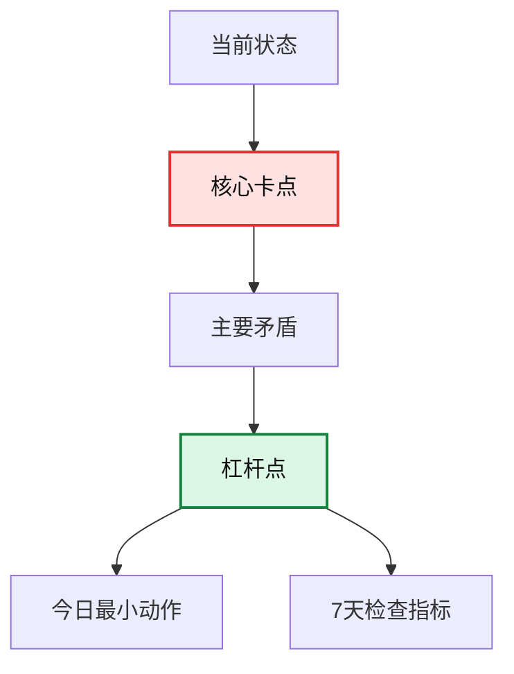

# 人生复盘量表 LRS-100

这是一个用于考试、求职、考公考研、亲密关系、职业选择、金钱决策、健康习惯等事件的通用复盘量表。它把市面上常见复盘方法合并成一个流程：先还原事实，再分离目标与结果，再分析原因，最后形成下一次可执行的实验。

## 方法来源地图

| 方法 | 核心用途 | 放进本量表的位置 |
| --- | --- | --- |
| AAR / After Action Review | 问清楚“原本要发生什么、实际发生什么、为什么不同、下次怎么办” | 事实、目标、结果差距 |
| GRAI 复盘法 | Goal, Result, Analysis, Insight | 全流程骨架 |
| Gibbs / Kolb 反思循环 | 经验 -> 感受/观察 -> 概念化 -> 新行动 | 情绪、学习、行动实验 |
| ORID | Objective, Reflective, Interpretive, Decisional | 事实、感受、意义、决定 |
| 5 Whys / 鱼骨图 | 从表层问题追到根因 | 根因分析 |
| PDCA / DMAIC | 计划、执行、检查、改进；定义、测量、分析、改进、控制 | 行动闭环和复盘节奏 |
| KPT / KISS / Start-Stop-Continue / 4Ls | 把经验转成继续、停止、开始、改进 | 行动清单 |
| 决策日志 / Decision Journal | 区分“决策质量”和“结果好坏” | 决策过程质量 |
| Pre-mortem | 在未来失败前预演风险 | 下一次行动前的风险预演 |
| 双环学习 | 不只改行为，还检查底层假设、价值和系统 | 人生模式识别 |

## 互联网复盘方法库

网上的复盘方法很多，名字也很多，但大多数可以归入 7 类功能。以后遇到新方法，不必重新发明一套系统，只要判断它属于哪一类，再放进 LRS-100 使用。

| 功能 | 常见互联网方法/模板 | 适合解决的问题 | 输出物 |
| --- | --- | --- | --- |
| 1. 记录事实 | 时间线复盘、事件日志、GTD Weekly Review、年度回顾、Lessons Learned Log | 事情太乱、记忆模糊、只剩情绪 | 时间线、证据清单、关键节点 |
| 2. 对齐目标 | AAR、GRAI、OKR Check-in、SMART、考试 Exam Wrapper | 不知道偏差从哪里开始 | 目标-结果差距、偏差列表 |
| 3. 承认情绪 | ORID、Mad/Sad/Glad、4Ls、Gibbs Reflective Cycle | 情绪很重、无法客观看待事件 | 感受清单、需求清单、能量变化 |
| 4. 追问根因 | 5 Whys、鱼骨图、Pareto、Blameless Postmortem、RCA | 同类问题反复出现 | 根因链、系统漏洞、触发条件 |
| 5. 转成行动 | KPT、KISS、Start/Stop/Continue、PDCA、DMAIC | 复盘完还是不知道怎么改 | 行动清单、负责人、截止时间、指标 |
| 6. 预演风险 | Pre-mortem、Sailboat、Decision Journal、OODA | 下一次可能重蹈覆辙 | 风险清单、止损线、if-then 预案 |
| 7. 沉淀知识 | Playbook、Checklist、SOP、Runbook、个人规则库 | 经验没有复用，下次又从零开始 | 个人原则、检查表、模板、流程 |

### 方法选择器

| 你现在的状态 | 优先使用 |
| --- | --- |
| 我说不清发生了什么，只觉得一团乱 | 时间线复盘 + ORID |
| 我知道失败了，但不知道和目标差在哪 | AAR + GRAI |
| 我一直在同一个地方摔倒 | 5 Whys + 鱼骨图 + 双环学习 |
| 我复盘后总是只会说“下次努力” | KPT/KISS + PDCA |
| 我在做重大选择，怕以后后悔 | Decision Journal + Pre-mortem |
| 我需要周复盘、月复盘、年度复盘 | GTD Weekly Review + Year Review + 领域模块 |
| 我在做项目、论文、账号、副业 | Lessons Learned + Sailboat + DMAIC |
| 我在关系里受伤、委屈、愤怒 | ORID + 关系互动模块 + 修复尝试 |
| 我想改习惯但总失败 | COM-B + if-then 计划 + 最小动作 |

### 五层复盘栈

无论网上方法叫什么，真正有效的复盘都应该走完这五层：

1. 事实层：发生了什么？证据是什么？
2. 体验层：我当时怎么感受、怎么反应？
3. 机制层：为什么会这样？哪些系统条件促成了它？
4. 决策层：下次我如何选择、如何行动、如何提前防错？
5. 沉淀层：这次经验能变成什么规则、清单、模板或提醒？

如果一次复盘只停在第 1-2 层，它更像倾诉；能到第 3 层，开始有洞察；能到第 4-5 层，才会真正改变下一次。

## 复盘最终产出

使用这套量表后，不只是得到一个分数，而是产出一份“处境诊断 + 行动方案”。标准输出包括：

| 输出 | 回答的问题 | 形式 |
| --- | --- | --- |
| 1. 事件诊断 | 这件事本质上属于学习问题、决策问题、关系问题、习惯问题，还是人生阶段问题？ | 事件类型判断 |
| 2. 当前困难 | 你现在具体难在哪里？是信息不足、执行断裂、情绪过载、资源不够，还是方向冲突？ | 困难清单 |
| 3. 核心卡点 | 哪一个环节卡住后，导致后面连续失效？ | 卡点定位 |
| 4. 主要矛盾 | 当前最支配局面的冲突是什么？ | 一句话主要矛盾 |
| 5. 次要矛盾 | 还有哪些问题在干扰你，但不是最优先要解决的？ | 次要矛盾列表 |
| 6. 矛盾的主要方面 | 在主要矛盾里，哪一边更决定结果？例如“目标过高”还是“反馈太少”？ | 主导因素判断 |
| 7. 根因链 | 为什么会这样？表层原因下面的机制是什么？ | 2-3 条 5 Whys 链 |
| 8. 可控性分层 | 哪些能控制、能影响、只能接受？ | 三层清单 |
| 9. 哲学解释 | 这件事背后体现了什么关于选择、行动、欲望、限制、变化的规律？ | 哲学视角 |
| 10. 破局策略 | 应该先改哪个系统变量，才能带动其他问题松动？ | 杠杆点 |
| 11. 7 天实验 | 接下来一周具体做什么来验证新策略？ | 小实验 |
| 12. 个人规则 | 这次复盘沉淀成什么以后可复用的原则？ | 原则/检查表 |
| 13. 流程图 | 用代码流程图展示卡点、矛盾、每日行动和遇阻分流 | Mermaid 图 |

### 建议输出风格

复盘建议必须“简单、直接、可执行”。不能只停留在心灵安慰，也不能只给冷冰冰的任务。每条关键建议都要同时包含两层：

| 层次 | 作用 | 写法 |
| --- | --- | --- |
| 心灵/认知层 | 帮你理解自己为什么卡住，减少羞耻和混乱 | 解释一句“这不是你整个人不行，而是哪个机制失效” |
| 实际行动层 | 帮你马上知道下一步做什么 | 给出一个具体动作、时间、频率、检查指标 |
| 环境改造层 | 减少靠意志硬撑 | 明确要移除、准备、屏蔽、固定的环境条件 |
| 复查指标层 | 防止建议说完就散 | 明确 7 天后看什么数据，而不是凭感觉判断 |

建议默认使用“直白版”。如果用户要求“毒舌版”，可以更尖锐，但不能羞辱人格、制造绝望或把复杂问题简化成骂人。毒舌的目标是打断自欺，不是攻击自尊。如果用户要求“督促版”，输出要更像执行教练：少解释，多指定今天做什么、什么时候交、怎么打卡。

| 模式 | 适合场景 | 语气要求 |
| --- | --- | --- |
| 直白版 | 默认模式；用户需要清醒、稳定、可执行的建议 | 温和但不绕弯，直接说问题和下一步 |
| 毒舌版 | 用户明确要求被点醒；长期自欺、拖延、逃避时 | 犀利、短句、有冲击力，但不做人身否定 |
| 督促版 | 用户需要被推着执行、打卡、复查；想得多做得少时 | 坚定、具体、有截止时间、减少选择 |

#### 同一条建议的两种写法

直白版：

```text
你现在最大的问题不是不努力，而是没有反馈系统。接下来 7 天不要再重做计划，每天只做一件事：完成 30 分钟限时训练，并记录错因。
```

毒舌版：

```text
你不是缺计划，你是把“做计划”当成努力的替代品。别再美化焦虑了。接下来 7 天，每天 30 分钟限时训练，错题不复盘就等于没学。
```

#### 建议格式

```text
建议模式：直白版 / 毒舌版 / 督促版

1. 你现在最该停止：
2. 你现在最该开始：
3. 你必须接受的现实：
4. 你可以立刻改变的动作：
5. 7 天检查标准：
```

#### 督促版格式

督促版不是骂人，而是把行动变窄、变短、变硬。它要让用户今天就知道交什么。

```text
今天只盯一件事：
最低版本：
标准版本：
开始时间：
截止时间：
不许做的事：
卡住时：
晚上打卡格式：
1. 做了/没做：
2. 做到哪一步：
3. 卡住原因：
4. 明天是否继续同一任务：
```

督促版规则：

1. 一次只布置一个主任务。
2. 必须有最低版本，防止用户因为做不到完美就放弃。
3. 必须有截止时间，不能写“有空就做”。
4. 必须有打卡格式，方便用户回来复查。
5. 用户没完成时，先调整系统，不做人格审判。

### 响应深度模式

复盘不是每次都要写成长报告。根据用户状态选择最小有效输出：

| 模式 | 适合场景 | 输出 |
| --- | --- | --- |
| Mini 迷你版 | 用户很累、很乱、只想先抓重点 | 1 个结论、1 个卡点、1 个动作 |
| Standard 标准版 | 一般人生事件复盘 | 诊断、矛盾、根因、行动、1 张流程图 |
| Deep 深度版 | 重大选择、反复失败、长期困境 | LRS-100、领域模块、哲学分析、流程图、7 天执行卡 |
| Tracker 追踪版 | 用户执行 7 天后回来复查 | 实际 vs 计划、暴露的新卡点、修订实验 |
| 督促版 | 用户要求监督、催促、打卡、问责 | 今日主任务、截止时间、打卡格式、失败降级方案 |

### 流程图输出

当用户要求“流程图”“可视化”“用代码展示”，或事件里同时存在多个卡点时，输出 Mermaid 流程图。流程图不是装饰，而是为了让用户一眼看到“我卡在哪里、每天该怎么走、卡住时怎么分流”。

建议输出 1-3 张图：

| 图 | 用途 | 何时使用 |
| --- | --- | --- |
| 卡点诊断图 | 当前状态 -> 核心卡点 -> 主要矛盾 -> 杠杆点 | 用户说混乱、困住、不知道为什么 |
| 每日行动流程图 | 起床/启动 -> 环境切换 -> 付费工作 -> 增长动作 -> 复盘 -> 休息 | 用户需要每天照着做 |
| 遇阻分流图 | 想逃避/太累/没灵感/没反馈时分别怎么办 | 用户容易中断、拖延、放弃 |
| 行为循环图 | 触发 -> 想法 -> 情绪 -> 行为 -> 后果 -> 替代动作 | 用户反复陷入同一行为模式 |

流程图规则：

1. 用 Mermaid `flowchart TD` 或 `flowchart LR`。
2. 节点文字要短，不要把长段建议塞进图里。
3. 当前卡点用 `:::stuck` 标记。
4. 最重要的破局动作用 `:::lever` 标记。
5. 图后必须用 3-5 句话解释怎么读这张图。

模板：



### 执行卡输出

当用户的问题涉及拖延、行动断裂、自由职业、自媒体、学习计划、习惯改变时，必须输出“今日执行卡”。执行卡要小到当天能做，不能写成宏大愿景。

```text
今日最低版本：
固定时间：
固定地点：
开始动作：
完成标准：
遇阻 if-then：
记录指标：
今晚复盘一句话：
打卡格式：
```

原则：如果用户卡住了，先降低动作尺寸，再提高人生野心。

### 7 天追踪复盘

当用户执行一段时间后回来，不要重新讲理论。先用下面 5 个问题做追踪：

```text
1. 过去 7 天做了几天？
2. 哪一天最容易断？
3. 断掉前发生了什么？
4. 哪个动作太大、太模糊、太依赖情绪？
5. 下一个 7 天要保留、删除、降低、升级什么？
```

追踪版输出：

```text
1. 计划 vs 实际：
2. 行为暴露出的真实卡点：
3. 需要删除的动作：
4. 需要降低的动作：
5. 需要保留的动作：
6. 新的 7 天实验：
```

### 认知资料库

当用户希望“把之前的人生回顾都储存起来”“让 AI 更了解我”“建立对我的认知资料库”时，使用本模块。这个功能必须是可选、私密、本地优先。

隐私规则：

1. 保存前必须征求用户同意。
2. 默认保存压缩后的摘要、模式、目标、卡点、偏好和实验结果，不保存原始聊天全文。
3. 个人记忆默认保存在本地，不上传到公开 GitHub 仓库。
4. 不保存密码、身份证号、精确住址、私人联系方式、第三方隐私。
5. 医疗、法律、财务、安全相关内容只保存用户确认过的摘要。
6. 用户可以随时要求查看、修改、删除或停止记忆。

默认存储位置：

```text
~/.life-review/memory.md
./life-review-memory.local.md
```

建议优先使用 `~/.life-review/memory.md` 作为跨项目记忆；如果用户只想在当前工作区使用，则使用 `./life-review-memory.local.md`。本仓库应通过 `.gitignore` 排除本地记忆文件。

认知资料库结构：

```markdown
# Life Review Personal Memory

## Stable Facts

## Current Goals

## Recurring Patterns

## Stuck Points

## Effective Strategies

## Preferences

## Open Questions

## Review Log
```

每次复盘结束时，可以给出“记忆更新建议”：

```text
要不要把这次复盘压缩成一条“认知资料库”记忆？
我会只保存摘要、模式、卡点和下一步实验，不保存你的原话。
```

记忆条目模板：

```markdown
### YYYY-MM-DD - 事件名称

- Summary:
- Current context:
- Core stuck point:
- Primary contradiction:
- Recurring pattern:
- Effective strategy:
- Next experiment:
- Follow-up date:
```

读取记忆时要说明：这是基于历史资料的推断，不是事实判决。如果当前信息和历史记忆冲突，以当前信息为准，并询问是否更新记忆。

### 困难与卡点分类

| 卡点类型 | 典型表现 | 复盘时要问 |
| --- | --- | --- |
| 目标卡点 | 想要很多东西，但不知道哪个最重要 | 我真正要解决的问题是什么？ |
| 信息卡点 | 凭想象决策，不知道真实难度和路径 | 我缺哪类证据、反馈、样本、基准率？ |
| 方法卡点 | 很努力，但方法低效或不适配 | 我是在重复投入，还是在有效训练？ |
| 执行卡点 | 计划很好，但启动不了、坚持不了 | 失败发生在什么时间、场景、情绪之后？ |
| 情绪卡点 | 羞耻、恐惧、焦虑让人逃避 | 我是在解决问题，还是在躲避感受？ |
| 资源卡点 | 时间、钱、身体、支持系统不足 | 目标和资源是否匹配？需要降级还是补资源？ |
| 关系卡点 | 被他人期待、冲突、边界问题牵制 | 哪些是我的责任，哪些不是？ |
| 叙事卡点 | 把事件解释成“我不行” | 有没有更具体、更可改变的解释？ |
| 系统卡点 | 环境不断把人推回旧模式 | 哪个制度、流程、环境诱导了失败？ |

## 哲学分析层

哲学在复盘里不是用来讲大道理，而是用来帮你看清“问题的结构”。一次高质量复盘至少可以从下面几个哲学视角里选择 1-3 个。

### 1. 矛盾分析

适合分析人生选择、长期困境、反复失败。核心问题：

- 主要矛盾是什么？当前最决定局面的冲突是什么？
- 次要矛盾是什么？哪些问题存在，但不是第一优先级？
- 矛盾的主要方面是什么？在这组冲突里，哪一边更支配结果？
- 矛盾有没有转化？过去的优势是否正在变成限制？

例子：考研失败的主要矛盾可能不是“我不够努力”，而是“目标难度很高，但反馈系统太弱”。次要矛盾可能是作息、资料选择、情绪波动。破局点不是先骂自己，而是建立高频反馈和错题闭环。

### 2. 实践论

适合解决“想很多、做很少”“懂道理但不改变”。核心问题：

- 我有没有把想法放进真实实践里检验？
- 我的认识来自经验、证据和反馈，还是来自焦虑和想象？
- 下一步能不能用一个小实验，把抽象判断变成可验证结果？

原则：认识不是靠空想完成的，而是在“实践 -> 反馈 -> 修正 -> 再实践”里变清楚。

### 3. 斯多葛视角

适合处理焦虑、后悔、失败、不可控结果。核心问题：

- 这件事里什么由我控制，什么只能影响，什么必须接受？
- 我是否把注意力浪费在不可控结果上，却忽略了可控行动？
- 如果结果无法立刻改变，我还能保持哪一种行动尊严？

原则：对结果保持清醒，对行动保持负责。

### 4. 存在主义视角

适合处理迷茫、选择恐惧、身份焦虑。核心问题：

- 这是我自己的选择，还是我在替别人期待活着？
- 我害怕的到底是失败，还是失败后无法解释自己？
- 如果没有一个绝对正确答案，我愿意为哪个选择承担后果？

原则：人生很多重大选择不是找到标准答案，而是通过选择成为某种人。

### 5. 实用主义视角

适合把复盘从抽象道理转成有效行动。核心问题：

- 这个解释能不能改善我的下一次行动？
- 这个信念让我更有力量，还是让我更停滞？
- 哪个方案能在最短周期内得到真实反馈？

原则：一个观念的价值，要看它在现实中产生什么后果。

### 6. 现象学视角

适合处理情绪、人际关系、创伤性记忆和自我误解。核心问题：

- 在贴标签之前，我当时真实体验到了什么？
- 我的身体、注意力、恐惧和期待如何改变了我对事件的理解？
- 我有没有把后来知道的东西，强行塞回当时的自己身上？

原则：先回到经验本身，再解释经验。

### 7. 道家视角

适合处理过度用力、逆势硬扛、控制欲强。核心问题：

- 我是在顺着事情的结构发力，还是只靠意志硬推？
- 有没有更小、更自然、更省力的切入点？
- 我是否把阶段性停顿误认为失败？

原则：不是所有问题都靠加力解决，有些问题要先看势、借势、顺势。

### 8. 佛学视角

适合处理执念、痛苦、比较、得失心。核心问题：

- 我痛苦的是事实本身，还是我对事实的执着解释？
- 我是否把一次结果当成永久身份？
- 哪些欲望、恐惧、比较正在放大痛苦？

原则：看见执着，不等于放弃行动；它是为了让行动少一点被痛苦劫持。

### 哲学输出模板

```text
哲学分析：
1. 主要矛盾：
2. 次要矛盾：
3. 矛盾的主要方面：
4. 当前最关键的转化点：
5. 可控/可影响/不可控：
6. 最适合解释这件事的哲学视角：
7. 这件事给我的人生原则：
```

## 使用原则

1. 一次只复盘一件具体事件，不要一次复盘整个人生。
2. 先讲事实，再讲解释。事实包括时间、地点、选择、行动、结果、证据。
3. 分离“结果不好”和“决策不好”。一次坏结果可能来自好决策加坏运气；一次好结果也可能来自坏决策加好运气。
4. 只追究可学习的机制，不做人格审判。
5. 每次复盘必须产出一个 7 天内可执行的小实验。

## 最小输入模板

如果你想让我帮你复盘，发下面 8 项就够了。可以匿名、模糊人名、隐藏隐私。

```text
1. 事件名称：
2. 时间范围：
3. 当时目标：我原本想要什么？
4. 实际结果：最后发生了什么？
5. 关键过程：中间做过哪些选择和行动？
6. 当时信息：我当时知道什么、不知道什么、误判了什么？
7. 情绪状态：当时主要情绪、压力、恐惧、期待是什么？
8. 现在最想搞清楚的问题：
```

如果信息不全，也可以只发一句话，例如：“我想复盘考研失败，我不知道从哪说起。”然后由我追问。

## LRS-100 评分表

每项 0-5 分。0 分表示完全缺失，3 分表示大致有但不清楚，5 分表示具体、可验证、能指导下一次行动。总分不是为了评价你这个人，而是为了判断这次复盘有没有复到位。

### A. 事实与目标，20 分

| 项目 | 评分问题 |
| --- | --- |
| 1. 目标清晰度 | 当时目标是否具体、可衡量、有时间边界？ |
| 2. 事实还原度 | 是否还原了关键时间线、选择点、行动和外部条件？ |
| 3. 结果差距 | 是否明确“预期结果”和“实际结果”的差异？ |
| 4. 证据完整度 | 是否有成绩、记录、反馈、数据、聊天记录、日程等证据，而不只靠印象？ |

### B. 决策与执行，20 分

| 项目 | 评分问题 |
| --- | --- |
| 5. 选项意识 | 当时是否看见了多个可选方案，而不是默认只有一条路？ |
| 6. 假设识别 | 是否写出了当时隐含假设，例如“只要努力就能上岸”“晚点开始也来得及”？ |
| 7. 执行质量 | 计划是否被拆成可执行动作，执行是否稳定，有没有反馈机制？ |
| 8. 资源匹配 | 时间、能力、信息、身体状态、情绪能量是否匹配目标难度？ |

### C. 原因与模式，25 分

| 项目 | 评分问题 |
| --- | --- |
| 9. 根因深度 | 是否至少追问 3-5 层“为什么”，直到找到可改变的机制？ |
| 10. 可控性分层 | 是否区分了可控、可影响、不可控因素？ |
| 11. 系统视角 | 是否看到环境、激励、流程、反馈、关系结构对结果的影响？ |
| 12. 情绪诚实度 | 是否承认恐惧、羞耻、逃避、侥幸、过度自信等当时真实状态？ |
| 13. 重复模式 | 是否发现它和过去类似事件的共同模式？ |

### D. 学习与行动，25 分

| 项目 | 评分问题 |
| --- | --- |
| 14. 经验提炼 | 是否把教训写成可复用规则，而不是一句“下次努力”？ |
| 15. 行动具体度 | 是否产出 Start / Stop / Continue / Improve 四类动作？ |
| 16. 风险预演 | 是否预演“下次又失败会因为什么”，并提前设置防线？ |
| 17. 检验指标 | 是否定义了下一次怎么判断自己真的变好了？ |
| 18. 复盘闭环 | 是否安排了下一次检查日期、触发条件、复盘节奏？ |

### E. 人生整合，10 分

| 项目 | 评分问题 |
| --- | --- |
| 19. 价值校准 | 是否看见这件事背后真正重要的价值、需求或人生方向？ |
| 20. 自我叙事 | 是否形成一种更准确的自我理解，而不是“我就是不行”？ |

## 评分解释

| 总分 | 说明 | 下一步 |
| --- | --- | --- |
| 0-39 | 还停留在情绪宣泄或零散回忆 | 先补事实和时间线 |
| 40-59 | 已经看到问题，但根因和行动不够具体 | 做 5 Whys、可控性分层 |
| 60-79 | 复盘基本有效，能指导下一次行动 | 增加指标和 7 天实验 |
| 80-100 | 高质量复盘，已经形成可迁移的方法 | 固化为个人规则和周期检查 |

## 分方向复盘模块

通用 20 维度适合做“底盘检查”，但真正复盘时要先判断事件类型。建议用两层结构：

1. 快速复盘：直接使用 LRS-100 的 20 个通用维度。
2. 深度复盘：通用维度占 60 分，再选择一个领域模块占 40 分。领域模块不是越多越好，一次复盘最多选 1-2 个。

### 领域选择表

| 事件类型 | 最适合的模块 | 典型事件 |
| --- | --- | --- |
| 考试与学习 | 学习系统模块 | 中考、高考、四六级、考研、考公、证书考试 |
| 求职与职业 | 职业路径模块 | 找工作、跳槽、选行业、面试失败、工作不适应 |
| 重大人生选择 | 决策质量模块 | 是否考研、是否考公、是否换城市、是否辞职、是否分手 |
| 关系与沟通 | 关系互动模块 | 亲密关系、家庭冲突、朋友疏远、合作破裂 |
| 习惯与健康 | 行为改变模块 | 拖延、熬夜、运动、饮食、手机沉迷、自律失败 |
| 金钱与消费 | 金钱决策模块 | 冲动消费、投资亏损、负债、储蓄失败、职业收入选择 |
| 项目与创造 | 项目增长模块 | 创业、副业、内容账号、论文、作品集、长期项目 |
| 情绪与低谷 | 情绪恢复模块 | 崩溃、长期焦虑、羞耻感、回避、失败后的自我怀疑 |

### 1. 学习系统模块，40 分

适用于中考、高考、四六级、考研、考公、证书考试。重点不是问“我努不努力”，而是问“我的学习系统有没有产生稳定反馈”。

| 维度 | 评分问题 |
| --- | --- |
| 学科/题型定位 | 是否知道自己具体输在哪些科目、题型、知识块、能力层？ |
| 学习方法质量 | 是否使用主动回忆、错题复盘、间隔复习、限时训练，而不是只看课、抄笔记、感动式学习？ |
| 反馈频率 | 是否有周测、模考、错题统计、阶段排名、老师/同伴反馈？ |
| 时间与精力配置 | 是否把高分值、高短板、高杠杆内容放在最好的时间段？ |
| 考场策略 | 是否复盘了时间分配、做题顺序、心态波动、粗心类型和临场决策？ |
| 备考节奏 | 是否识别启动太晚、计划过满、复习断档、后期崩盘等节奏问题？ |

建议补充材料：成绩单、各科分数、错题样本、模考曲线、每日/每周计划、实际执行记录、考试当天回忆。

### 2. 职业路径模块，40 分

适用于求职、跳槽、职业方向、面试失败、工作不适应。重点是匹配，而不是单纯问“我够不够优秀”。

| 维度 | 评分问题 |
| --- | --- |
| 价值匹配 | 这条路径是否符合你真正重视的东西：稳定、收入、成长、自由、意义、城市、关系？ |
| 能力匹配 | 目标岗位/行业要求什么能力，你已有、缺失、可迁移的能力分别是什么？ |
| 市场理解 | 是否了解真实招聘需求、竞争者水平、薪资区间、行业周期？ |
| 漏斗数据 | 投递、笔试、面试、复试、offer 分别卡在哪一层？ |
| 职业资本 | 这次选择会增加什么可复用资本：技能、作品、人脉、信誉、行业理解？ |
| 机会成本 | 选择这条路的同时，放弃了哪些时间、选择权和备选路径？ |

建议补充材料：简历、JD、投递数量、面试反馈、作品集、目标行业信息、你最看重的职业条件排序。

### 3. 决策质量模块，40 分

适用于考研/考公选择、城市选择、分手/继续、辞职/留下、是否投入一件长期事情。重点是把“结果好坏”和“当时决策质量”拆开。

| 维度 | 评分问题 |
| --- | --- |
| 问题框定 | 当时真正要解决的问题是什么？是安全感、身份、收入、逃避、证明自己，还是长期成长？ |
| 选项生成 | 是否认真生成过多个方案，包括折中方案和可逆小实验？ |
| 信息质量 | 当时依据的是证据、基准率和真实反馈，还是想象、焦虑、他人期待？ |
| 价值排序 | 当几个目标冲突时，你是否知道哪个更重要？ |
| 风险与可逆性 | 最坏情况是什么？是否可逆？有没有止损线和退出机制？ |
| 决策记录 | 是否记录过当时的理由、信心程度、预期结果、触发复查时间？ |

建议补充材料：当时的选择列表、各选项利弊、你最怕的结果、你最想要的结果、当时别人给你的建议、现在的结果。

### 4. 关系互动模块，40 分

适用于亲密关系、家庭、朋友、同学、同事合作。重点不是判谁对谁错，而是看互动循环、需求、边界和修复。

| 维度 | 评分问题 |
| --- | --- |
| 互动时间线 | 冲突是怎么一步步升级的？哪句话、哪个动作、哪个沉默是转折点？ |
| 双方需求 | 你真正需要什么？对方可能真正需要什么？安全感、尊重、自由、被看见、边界？ |
| 沟通方式 | 是否出现指责、防御、冷处理、讨好、翻旧账、过度解释？ |
| 边界清晰度 | 哪些是你能负责的，哪些不是你该负责的？你有没有说清楚底线？ |
| 修复尝试 | 冲突后是否有道歉、澄清、暂停、重新约定、实际补救？ |
| 重复脚本 | 这段关系是否反复进入同一种剧本？你在里面固定扮演什么角色？ |

建议补充材料：冲突经过、关键对话、你没说出口的话、对方的反应、你希望关系变成什么样、不可接受的底线。

### 5. 行为改变模块，40 分

适用于拖延、熬夜、运动、饮食、手机沉迷、学习自律。重点不是意志力，而是能力、机会、动机和环境设计。

| 维度 | 评分问题 |
| --- | --- |
| 行为定义 | 你要改变的行为是否具体到时间、地点、频率、动作？ |
| 能力条件 | 你是否真的具备完成它的技能、精力、身体状态和心理容量？ |
| 机会环境 | 环境是在帮你行动，还是在诱导你失败？ |
| 动机结构 | 你是被恐惧推着走，还是有稳定的内在理由和即时奖励？ |
| 障碍预案 | 是否写出 if-then 计划：如果出现 X，我就做 Y？ |
| 最小动作 | 是否有 2-10 分钟也能完成的最低版本，避免一次失败就全盘放弃？ |

建议补充材料：一周作息、触发失败的场景、手机/睡眠/运动记录、你尝试过的方法、最容易失败的时间点。

### 6. 金钱决策模块，40 分

适用于消费、储蓄、投资、负债、收入选择。重点是风险承受、现金流和情绪，而不是事后用涨跌评判自己聪不聪明。本模块只用于复盘和决策质量分析，不替代专业财务建议。

| 维度 | 评分问题 |
| --- | --- |
| 金钱目标 | 这笔钱服务于安全、自由、体验、面子、关系、成长，还是短期情绪？ |
| 现金流约束 | 当时是否清楚收入、支出、债务、备用金和未来必要开销？ |
| 风险承受 | 最坏亏损或后果出现时，你是否真的承受得起？ |
| 信息来源 | 决策依据是独立研究、规则和长期计划，还是他人推荐、热度、焦虑？ |
| 情绪触发 | 是否存在冲动、补偿心理、贪婪、恐惧、攀比、急于翻身？ |
| 规则化 | 是否形成预算、仓位、冷静期、止损线、复查日期等规则？ |

建议补充材料：金额、收入支出、决策前信息来源、当时情绪、实际结果、是否影响生活安全边际。

### 7. 项目增长模块，40 分

适用于创业、副业、内容账号、论文、作品集、长期项目。重点是验证假设，而不是只总结努力程度。

| 维度 | 评分问题 |
| --- | --- |
| 用户/受众 | 项目到底服务谁？他们真实痛点是什么？ |
| 核心假设 | 当时最关键、最不确定、最需要验证的假设是什么？ |
| 指标漏斗 | 曝光、点击、转化、留存、复购/复看分别卡在哪里？ |
| 资源节奏 | 时间、钱、人、技能、渠道是否匹配项目阶段？ |
| 迭代速度 | 是否快速做小实验，而不是一次憋大招？ |
| 资产沉淀 | 是否沉淀模板、流程、内容库、客户反馈、数据看板？ |

建议补充材料：项目目标、数据截图、用户反馈、发布频率、转化路径、你做过的实验和结果。

### 8. 情绪恢复模块，40 分

适用于失败后的羞耻、自责、逃避、长期低落、重大挫折。重点是恢复行动能力和自我理解，不做医学诊断。如果出现持续失眠、自伤想法、严重功能受损，优先找可信的人和专业支持。

| 维度 | 评分问题 |
| --- | --- |
| 触发链条 | 哪个事件触发了什么想法、情绪、身体反应和行为？ |
| 自我叙事 | 你把这件事解释成“我不行”，还是解释成一个具体系统出了问题？ |
| 回避机制 | 你用什么方式逃开痛苦：刷手机、睡觉、讨好、断联、幻想、过度计划？ |
| 支持系统 | 你有没有可以求助的人、稳定场所、规律作息、专业资源？ |
| 恢复动作 | 是否有低门槛、低羞耻、能当天完成的恢复动作？ |
| 意义整合 | 这件事让你更清楚自己需要保护什么、追求什么、放下什么？ |

建议补充材料：最近状态、触发事件、身体反应、睡眠饮食、人际支持、目前最难承受的念头。

## 领域模块使用提示词

```text
请使用“人生复盘量表 LRS-100 + 领域模块”帮我复盘。
先判断我的事件属于哪个领域；如果跨领域，最多选择 2 个模块。
建议模式默认使用“直白版”；如果我要求“毒舌版”，请用更尖锐但不羞辱人格的方式指出问题；如果我要求“督促版”，请直接给今日主任务、截止时间和打卡格式。
请输出：
1. 事件类型判断；
2. 当前困难与核心卡点；
3. 主要矛盾、次要矛盾、矛盾的主要方面；
4. 通用 20 维度中最关键的 5 个低分项；
5. 领域模块 40 分评分；
6. 这类事件特有的根因；
7. 最适合解释这件事的 1-3 个哲学视角；
8. 我下一次最该改变的 1 个系统变量；
9. Mermaid 流程图：卡点诊断图 + 每日行动流程图；
10. 直白版、毒舌版或督促版建议；
11. 今日执行卡；
12. 7 天小实验和复查问题。

我的事件如下：
【粘贴事件】
```

## 输出模板

每次复盘结束，建议固定输出下面 7 个结果：

```text
1. 一句话结论：
2. 事件类型：
3. 当前困难：
4. 核心卡点：
5. 主要矛盾：
6. 次要矛盾：
7. 矛盾的主要方面：
8. 事实时间线：
9. 目标-结果差距：
10. 根因树：
11. 哲学解释：
12. 重复模式：
13. 建议模式：直白版 / 毒舌版 / 督促版
14. 流程图：
   - 卡点诊断图：
   - 每日行动流程图：
   - 遇阻分流图：
15. 下一次行动：
   - Start：
   - Stop：
   - Continue：
   - Improve：
16. 你现在最该停止：
17. 你现在最该开始：
18. 你必须接受的现实：
19. 你可以立刻改变的动作：
20. 7 天实验和检查日期：
21. 今日执行卡：
   - 今日最低版本：
   - 固定时间：
   - 固定地点：
   - 开始动作：
   - 完成标准：
   - 遇阻 if-then：
   - 记录指标：
   - 今晚复盘一句话：
22. 7 天后复查问题：
23. 督促版打卡格式：
24. 认知资料库更新建议：
```

## 直接给 AI 的提示词

```text
请使用“人生复盘量表 LRS-100”帮我复盘下面这件事。
要求：
1. 先区分事实、解释、情绪和证据。
2. 如果信息不足，先问我不超过 5 个关键问题。
3. 用 0-5 分给 20 个维度评分，并说明低分原因。
4. 用 5 Whys 找到至少 2 条根因链。
5. 区分可控、可影响、不可控因素。
6. 输出 Start / Stop / Continue / Improve 行动清单。
7. 建议默认用直白版；如果我要求毒舌版，可以尖锐但不能羞辱人格；如果我要求督促版，请给我今日主任务、截止时间和打卡格式。
8. 每条关键建议都要包含“认知解释 + 实际动作”。
9. 如果结构复杂，请用 Mermaid 输出卡点诊断图和每日行动流程图。
10. 给我一张今日执行卡。
11. 如果我要求建立认知资料库，请先给我一条可确认的记忆摘要，不要直接保存原始聊天。
12. 最后给我一个 7 天内能完成的小实验和复查问题。

我的事件如下：
【粘贴事件】
```

## 资料来源

- AAR: [U.S. Army TC 7-0.1 After Action Reviews](https://rdl.train.army.mil/catalog-ws/view/100.ATSC/A6C09408-2436-47A4-93A3-6684A1B59042-1739993594606/TC7_0x1.pdf), [WorkshopBank AAR](https://workshopbank.com/after-action-review-aar)
- GRAI / KISS: [MBA 智库 GRAI 复盘法](https://wiki.mbalib.com/wiki/GRAI%E5%A4%8D%E7%9B%98%E6%B3%95), [MBA 智库 KISS 复盘法](https://wiki.mbalib.com/wiki/KISS%E5%A4%8D%E7%9B%98%E6%B3%95)
- PDCA: [NIH Plan Do Check Act](https://nems.nih.gov/about-NEMS/Pages/NEMS_Plan_Do_Check_Act.aspx)
- DMAIC: [ASQ DMAIC](https://asq.org/Quality-resources/Dmaic)
- 5 Whys: [Institute for Healthcare Improvement 5 Whys](https://www.ihi.org/index.php/library/tools/5-whys-finding-root-cause), [Lean Enterprise Institute 5 Whys](https://www.lean.org/lexicon-terms/5-whys/)
- 4Ls: [Atlassian 4Ls Retrospective](https://www.atlassian.com/team-playbook/plays/4-ls-retrospective-technique)
- ORID: [Workshop Weaver ORID](https://workshopweaver.com/facilitation-methods/orid-focused-conversation)
- Gibbs / Kolb: [Simply Psychology Gibbs Reflective Cycle](https://www.simplypsychology.org/gibbs-reflective-cycle.html), [Simply Psychology Kolb Learning Cycle](https://www.simplypsychology.org/learning-kolb.html)
- 双环学习: [InstructionalDesign.org Double Loop Learning](https://www.instructionaldesign.org/theories/double-loop/)
- 复盘安全氛围: [TeamRetro Retrospective Prime Directive](https://www.teamretro.com/retrospective-prime-directive-2/)
- 学习复盘: [Carnegie Mellon Retrieval Practice](https://www.cmu.edu/teaching/resources/instructionalstrategies/activelearningstrategies/retrievalpractice/index.html), [PubMed Deliberate Practice Overview](https://pubmed.ncbi.nlm.nih.gov/18778378/), [NTU Self-Regulated Learning](https://www.ntu.edu.sg/nie/about-us/life%40nie-sg/child-and-human-development/cognitive-development/self-regulated-learning), [University of Chicago Exam Wrappers](https://teaching.uchicago.edu/resources/shaunna-mcleod-exam-wrappers-using-reflections-study-habits-support-student-learning)
- 决策与职业: [Alliance for Decision Education - Decision Quality](https://www.decisioneducation.org/principles-of-decision-quality/defining-decision-quality), [UCSF Career Reflection](https://career.ucsf.edu/gsp/career-exploration/reflection), [Georgetown Self-Exploration](https://careercenter.georgetown.edu/major-career-guides/self-exploration/)
- 关系复盘: [Gottman - Aftermath of a Fight](https://www.gottman.com/blog/manage-conflict-the-aftermath-of-a-fight/), [Gottman - Repair Practices](https://www.gottman.com/blog/protecting-your-relationship-practices-for-making-effective-repairs/)
- 行为改变: [COM-B Model](https://besci.org/models/capability-oppportunity-motivation-behavior), [Implementation Intentions](https://cancercontrol.cancer.gov/brp/research/constructs/implementation-intentions)
- 互联网复盘模板: [Atlassian Lessons Learned](https://www.atlassian.com/zh/software/confluence/templates/lessons-learned), [Miro Retrospective Templates](https://miro.com/templates/retrospective/), [Lucid Mad/Sad/Glad](https://lucid.co/templates/glad-sad-mad-sprint-retrospective), [Mural Sailboat Retrospective](https://www.mural.co/templates/sailboat-retrospective)
- 周期复盘与事故复盘: [GTD Weekly Review](https://gettingthingsdone.com/wp-content/uploads/2014/10/2016-GTD-Weekly-Review-.pdf), [Todoist Annual Review](https://www.todoist.com/templates/annual-review), [Year Compass](https://www.sessionlab.com/methods/year-compass), [Google SRE Postmortem Culture](https://sre.google/sre-book/postmortem-culture/)
